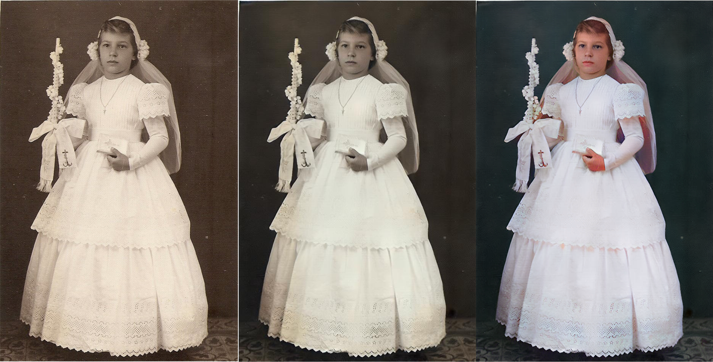
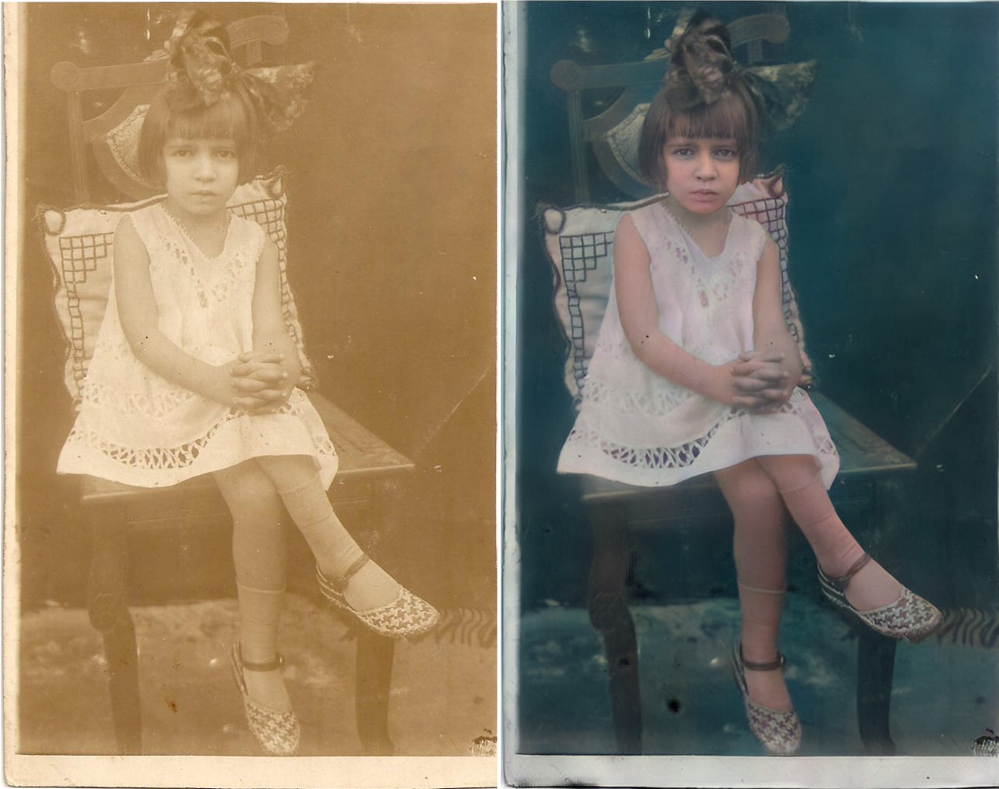
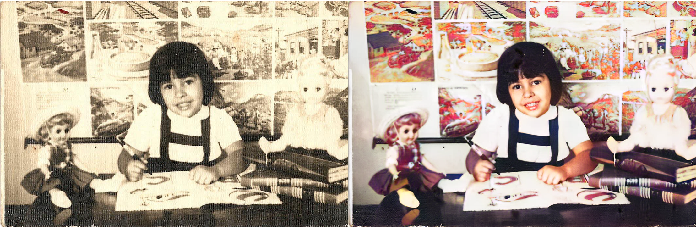
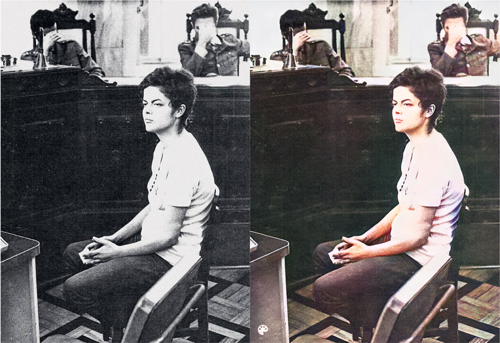
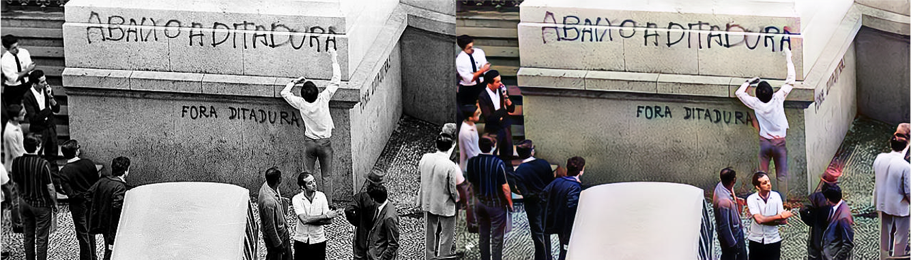
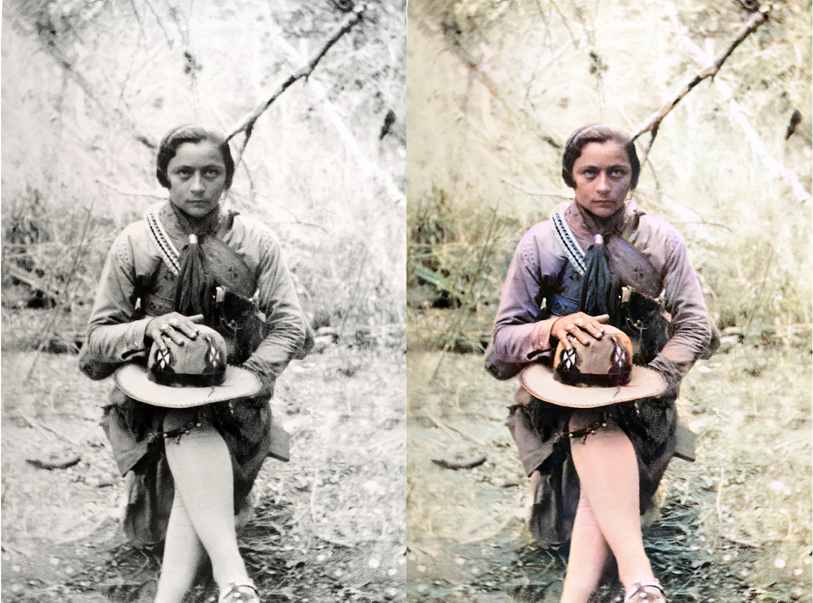

```{r echo=FALSE}
setwd("~/Documents/Projects/deeplearning_oldphotos")
```

## Deep latent space translation to old photo restauration + DeOldify for color

### Family photos





### Iconic photos from Brazil's history




